# WeTalk

<p align="center">
  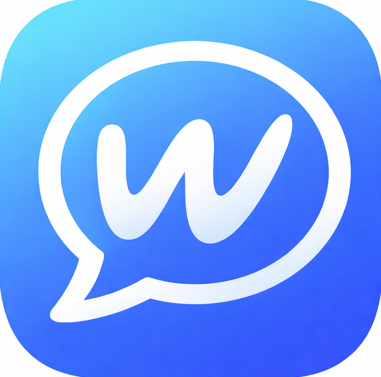
</p>

<p align="center">
  <b>A high-performance, feature-rich WhatsApp-inspired messaging and calling platform for Android.</b>
</p>

<p align="center">
  <a href="https://developer.android.com"></a>
  <a href="https://www.java.com"></a>
  <a href="https://firebase.google.com"></a>
  <a href="https://www.agora.io"></a>
  <a href="https://cloudinary.com"></a>
  
</p>

---

## 📋 Table of Contents
- [Overview](#-overview)
- [Key Features](#-key-features)
- [App Screenshots](#-app-screenshots)
  - [Authentication & Onboarding](#-authentication--onboarding)
  - [Messaging & Media Sharing](#-messaging--media-sharing)
  - [Group Conversations & Admin Controls](#-group-conversations--admin-controls)
  - [Voice & Video Calls & Status Updates](#-voice--video-calls--status-updates)
  - [Settings & Configuration](#-settings--configuration)
- [Tech Stack & Architecture](#-tech-stack--architecture)
- [Project Structure](#-project-structure)
- [Database Schema](#-database-schema)
- [Setup & Installation](#-setup--installation)
- [Permissions](#-permissions)
- [Author & Acknowledgments](#-author--acknowledgments)

---

## 🚀 Overview

**WeTalk** is a real-time communication suite built natively for Android in Java. It provides low-latency messaging, managed private group chats, 24-hour ephemeral status updates, and HD voice and video calling powered by the Agora RTC engine. 

Designed for reliability and performance, WeTalk handles real-time signaling via Firebase Realtime Database and Cloudinary media processing, alongside high-priority notification delivery using FCM HTTP v1 and full-screen intents to wake sleeping devices for incoming calls.

---

## ✨ Key Features

- **🔐 Authentication & User Profiles**:
  - Secure sign-in and registration via Firebase Auth (Email/Password & Google Sign-In).
  - Customizable profile photos, status messages, and bio info.

- **💬 Real-Time Messaging**:
  - Low-latency 1-on-1 direct conversations.
  - Delivery indicators, unread badge counters, and real-time message sync.

- **👥 Managed Group Chats**:
  - Create private or public groups with custom group avatars and descriptions.
  - Granular admin permissions for adding/removing members and managing group settings.

- **📸 Rich Media Sharing & Preview**:
  - Send high-quality images, videos, and documents via Cloudinary CDN integration.
  - Interactive media preview screen with captioning before sending.

- **⏳ Ephemeral Status Updates**:
  - Share image-based story updates that automatically expire after 24 hours.

- **📞 Professional Voice & Video Calling (Agora RTC)**:
  - Crystal-clear 1-on-1 voice and video calling powered by Agora SDK (v4.5.0).
  - In-call controls: Mute microphone, toggle speakerphone, switch camera, and live call timer.
  - **Full-Screen Call Ringing**: Background "wake-up" service triggers full-screen incoming call UI even when the app is closed or the device is locked.

- **🔔 High-Priority Smart Notifications**:
  - Real-time alerts for incoming messages and call invites utilizing Firebase Cloud Messaging (FCM v1 API) and server-side OAuth2 token fetching.

---

## 📱 App Screenshots

### 🔑 Authentication & Onboarding
| Sign In Screen | Sign Up Screen |
| :---: | :---: |
| 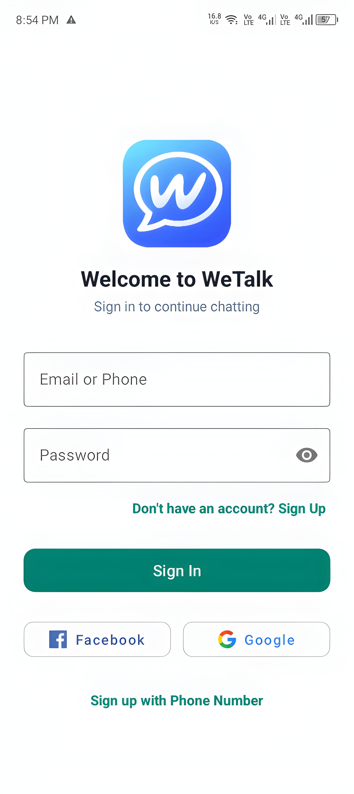 | 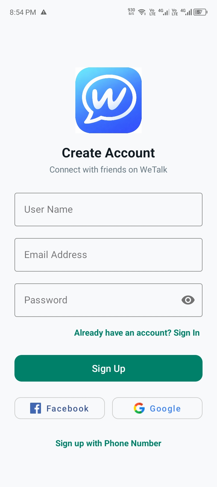 |
| Secure Authentication with Firebase & Google | Quick user registration and profile creation |

---

### 💬 Messaging & Media Sharing
| Recent Chats List | 1-on-1 Chat Conversation | Media Preview & Caption | Contact / Chat Info |
| :---: | :---: | :---: | :---: |
| 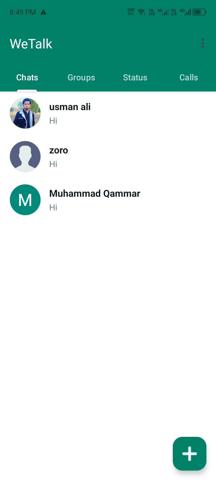 | 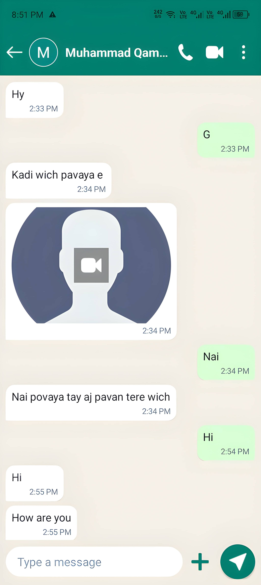 | 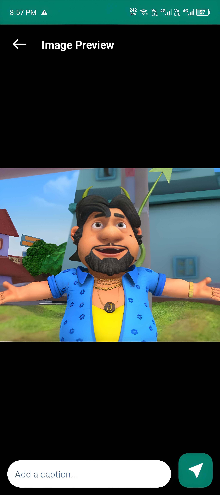 | 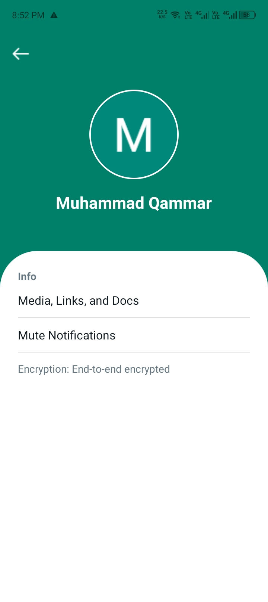 |
| Real-time chat list with unread counters | Instant messaging with rich media attachments | Interactive caption & preview prior to upload | Detailed user profile & media history |

---

### 👥 Group Conversations & Admin Controls
| Group Conversations | Create New Group | Group Info & Admin Panel |
| :---: | :---: | :---: |
| 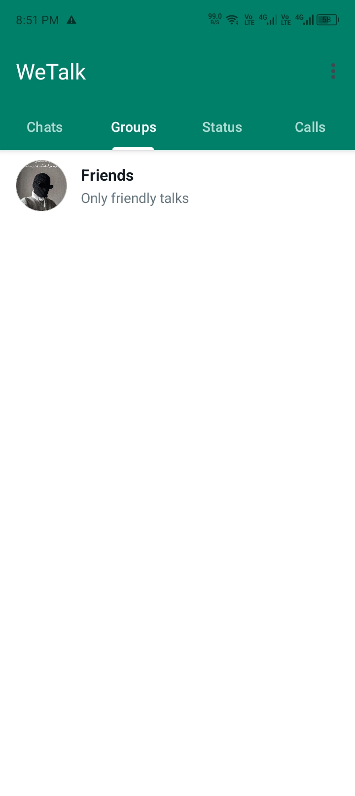 | 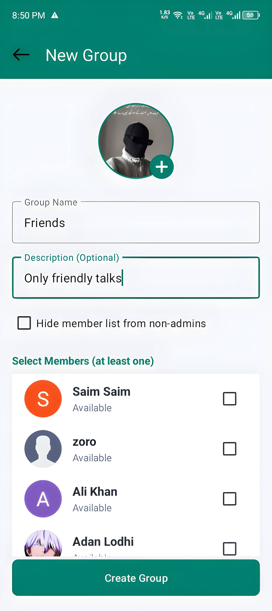 | 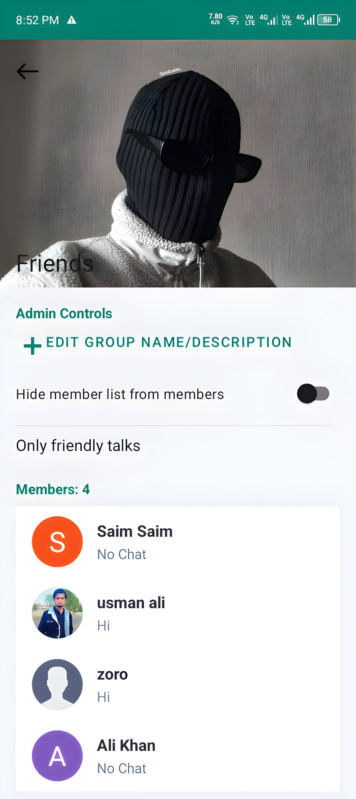 |
| Joined group channels list | Select members, avatar & group description | Admin controls, member roles & group customization |

---

### 📞 Voice & Video Calls & Status Updates
| 24-Hour Status Stories | Call History Log | Incoming Call Ringing | Active Video Call |
| :---: | :---: | :---: | :---: |
| 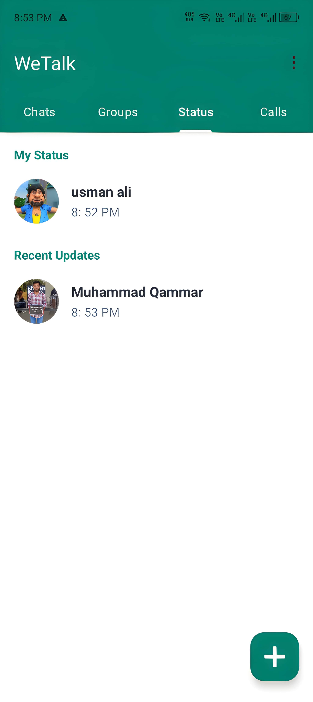 | 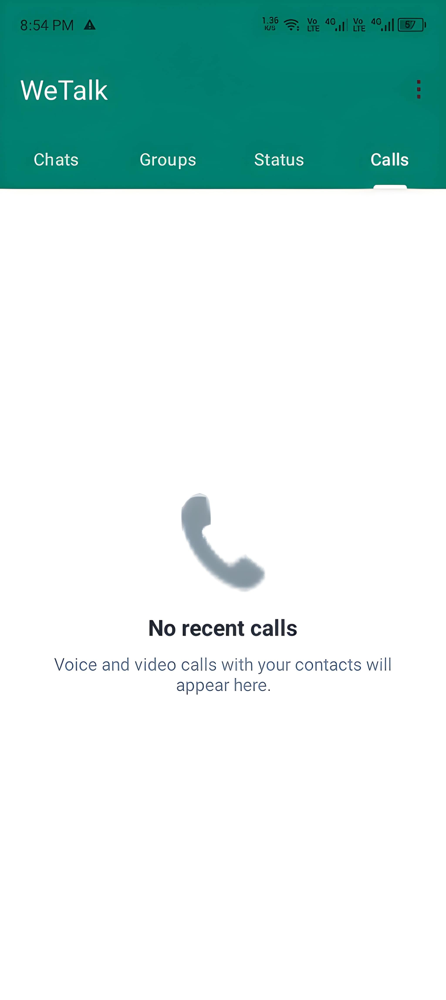 | 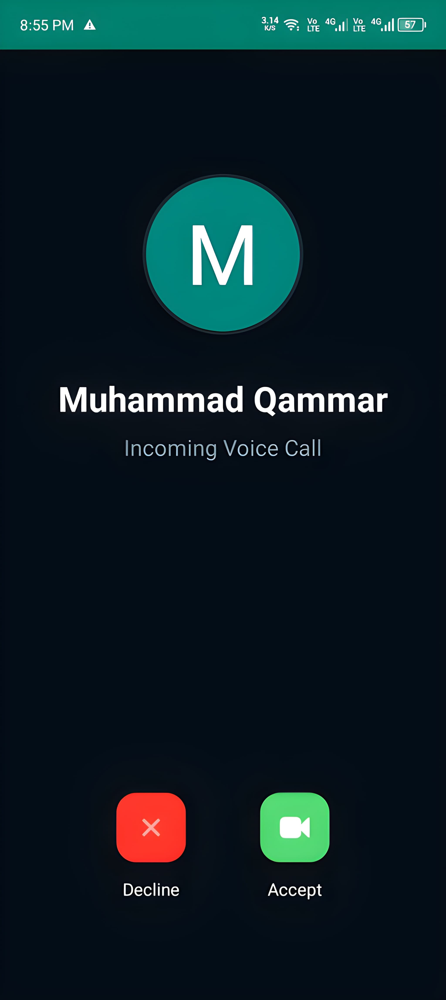 | 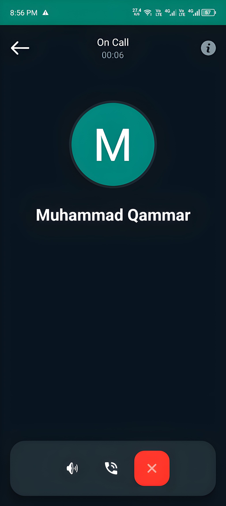 |
| Ephemeral story updates expiring in 24h | Detailed log of missed and completed calls | Full-screen lockscreen ring notification | Low-latency HD RTC video streaming |

---

### ⚙️ Settings & Configuration
| Settings & Profile Management |
| :---: |
| 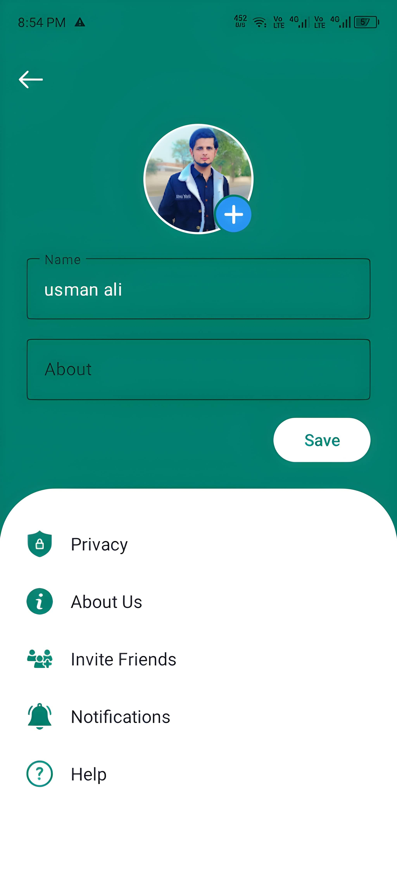 |
| Update profile avatar, user details & privacy settings |

---

## 🛠️ Tech Stack & Architecture

| Layer | Technology / Library | Purpose |
| :--- | :--- | :--- |
| **Language** | Java (JDK 17) | Core Application Logic |
| **UI Framework** | Material Components, ViewBinding, ConstraintLayout, RecyclerTouchListener | Responsive & Modern UI |
| **Real-Time Database** | Firebase Realtime Database | Messaging & Call Signaling |
| **Authentication** | Firebase Auth (Email/Password & Google Sign-In) | Identity Management |
| **Push Notifications** | Firebase Cloud Messaging (FCM v1 HTTP API) | Background Push Alerts & Calls |
| **RTC / Calling** | Agora Full SDK (`v4.5.0`) | High-definition Voice & Video Calls |
| **Media Cloud Storage** | Cloudinary Android SDK | Image, Video & Document Uploads |
| **Image Loading** | Picasso / Glide | Memory-efficient Image Caching |
| **Networking** | Retrofit 2 & Gson | REST API Calls & Token Management |
| **Token Server** | Node.js / Express (Hosted on Railway) | Secure RTC Token & FCM Payload Dispatch |

---

## 📂 Project Structure

```text
com.techtitans.usman.wetalk
├── Adapters/                # Recycler Adapters (Chats, Groups, Members, Status)
├── Calls/                   # Agora RTC engine integration & Call UI
│   ├── CallActivity.java          # Ongoing Voice/Video Call Activity
│   └── IncomingCallActivity.java  # Full-screen Ringing Activity
├── Fragments/               # Main Navigation Tabs
│   ├── CallsFragment.java         # Call History
│   ├── ChatFragment.java          # Active Direct Chats
│   ├── GroupFragment.java         # Active Group Chats
│   └── StatusFragment.java        # Status Updates
├── Interfaces/              # Retrofit Network Interfaces
├── Models/                  # POJO Data Models (GroupModel, MessageModel, Users, Status)
├── Services/                # FCM Service, OAuth2 Manager & Token Fetchers
│   ├── AgoraTokenFetcher.java     # Token Communication with Railway Node.js Server
│   ├── FcmAccessTokenManager.java # FCM HTTP v1 OAuth Token Handler
│   └── MyFirebaseMessagingService.java # Background Push Listener
├── ChatDetailActivity.java   # 1-on-1 Chat Room
├── CreateGroupActivity.java  # Group Creation Flow
├── GroupChatActivity.java   # Group Chat Room
├── GroupInfoActivity.java   # Group Management & Admin Controls
├── MainActivity.java        # Main Screen with Tab Navigation
├── MediaPreviewActivityV2.java # Media Preview & Captioning
├── SettingActivity.java     # User Settings & Profile Edit
├── SignInActivity.java      # Login Screen
└── SignUpActivity.java      # Registration Screen
```

---

## 🗄️ Database Schema

WeTalk utilizes a structured Firebase Realtime Database schema for real-time messaging, group management, and call signaling:

```json
{
  "Users": {
    "{uid}": {
      "userId": "{uid}",
      "userName": "Muhammad Usman",
      "mail": "usman@example.com",
      "profilePic": "https://res.cloudinary.com/...",
      "status": "Available",
      "fcmToken": "fcm_device_token_here"
    }
  },
  "Chats": {
    "{senderUid_receiverUid}": {
      "{msgId}": {
        "message": "Hello!",
        "senderId": "{uid}",
        "timestamp": 1710000000000,
        "type": "text"
      }
    }
  },
  "Groups": {
    "{groupId}": {
      "details": {
        "groupName": "Tech Titans Team",
        "groupIcon": "https://res.cloudinary.com/...",
        "createdBy": "{adminUid}",
        "description": "Official project group"
      },
      "members": {
        "{uid}": "admin"
      },
      "messages": {
        "{msgId}": {
          "message": "Welcome team!",
          "senderId": "{uid}",
          "timestamp": 1710000000000
        }
      }
    }
  },
  "Calls": {
    "{receiverUid}": {
      "callerId": "{senderUid}",
      "callerName": "Usman",
      "callerPic": "https://...",
      "channelName": "channel_12345",
      "token": "agora_rtc_token",
      "status": "ringing",
      "callType": "video"
    }
  }
}
```

---

## ⚙️ Setup & Installation

### Prerequisites
- Android Studio Ladybug (2024.2.1) or newer.
- JDK 17 configured in Android Studio.
- Android device or emulator running **Android 7.0 (API level 24)** or higher.

### Step-by-Step Instructions

1. **Clone the Repository**:
   ```bash
   git clone https://github.com/muhammad-usman/WeTalk.git
   cd WeTalk
   ```

2. **Configure Firebase**:
   - Create a project in [Firebase Console](https://console.firebase.google.com/).
   - Enable **Authentication** (Email/Password and Google Sign-In).
   - Enable **Firebase Realtime Database**.
   - Download `google-services.json` and place it in the `app/` root directory.

3. **Configure Service Account Key**:
   - In Firebase Console, navigate to **Project Settings > Service Accounts**.
   - Generate a new Private Key (`.json`), rename it to `service-account.json`.
   - Place `service-account.json` inside `app/src/main/assets/`.

4. **Configure Agora RTC**:
   - Sign up at [Agora.io](https://www.agora.io/) and create an application.
   - Obtain your **App ID** and **App Certificate**.
   - Deploy the token server or update `AgoraTokenFetcher.java` with your active token server URL.

5. **Build and Run**:
   - Open the project in Android Studio.
   - Sync Gradle dependencies.
   - Build and run the app on your Android device or emulator.

---

## 🔒 Permissions Used

| Permission | Purpose |
| :--- | :--- |
| `INTERNET` & `ACCESS_NETWORK_STATE` | Required for messaging, calls, and media uploads |
| `CAMERA` | Required for video calls and capturing status updates |
| `RECORD_AUDIO` & `MODIFY_AUDIO_SETTINGS` | Required for voice and video call audio streams |
| `READ_MEDIA_IMAGES` / `READ_MEDIA_VIDEO` | Accessing gallery media for chat attachments and status |
| `POST_NOTIFICATIONS` | Delivering push notification alerts on Android 13+ |
| `USE_FULL_SCREEN_INTENT` | Launching incoming call activity over lock screen |

---

## 👨‍💻 Author & Acknowledgments

Developed with ❤️ by **Muhammad Usman** and the **Tech Titans Team**.

- **GitHub**: [@muhammad-usman](https://github.com/muhammad-usman)
- **Role**: Lead Android Developer

---
<p align="center">
  <i>© 2025 WeTalk. All Rights Reserved.</i>
</p>
